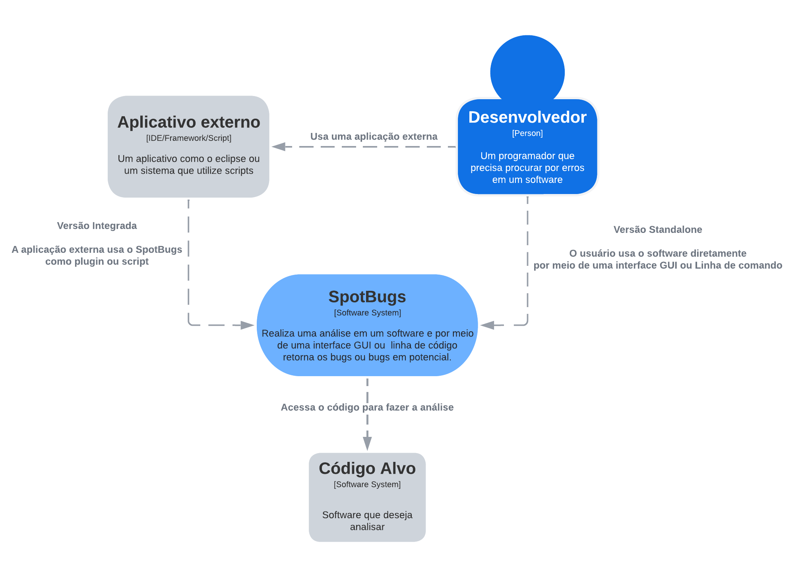
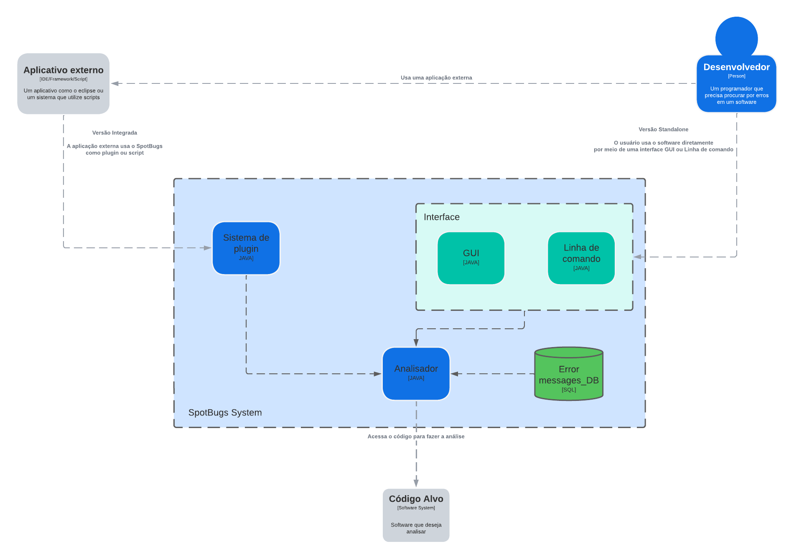

# SpotBugs

# Autores

Este documento foi produzido por: 

Arthur Dantas Porto
- Matrícula: 118210628
- Contato: joao.arthur@computacao.ufcg.edu.br

Renan Nunes Viana
- Matrícula: 118210164
- Contato: joao.arthur@computacao.ufcg.edu.br

Willy Guimarães Moraes Barros
- Matrícula: 118210278
- Contato: joao.arthur@computacao.ufcg.edu.br

Victor Paiva dos Santos
- Matrícula: 118210854
- Contato: joao.arthur@computacao.ufcg.edu.br

- Projeto documentado: https://github.com/spotbugs/spotbugs

# Descrição Arquitetural

Este documento descreve parte da arquitetura do projeto [SpotBugs](https://github.com/spotbugs/spotbugs). Essa descrição foi baseada principalmente no modelo [C4](https://c4model.com/).

É importante destacar não será descrita toda a arquitetura do SpotBugs. 

## Descrição Geral sobre o SpotBugs

SpotBugs is a program which uses static analysis to look for bugs in Java code. It is free software, distributed under the terms of the [GNU Lesser General Public License.](http://www.gnu.org/licenses/lgpl-3.0.html)

SpotBugs is a fork of [FindBugs](http://findbugs.sourceforge.net/) (which is now an abandoned project), carrying on from the point where it left off with support of its community. Please check [the official manual](https://spotbugs.readthedocs.io/en/latest/) for details.

SpotBugs requires JRE (or JDK) 1.8.0 or later to run. However, it can analyze programs compiled for any version of Java, from 1.0 to 1.9.

# O SpotBugs

## Objetivo Geral

Implementar um serviço para analisar e retornar bugs e possíveis bugs de um código de um Software alvo.

## Objetivos Específicos

Queremos ter acesso a o que pode apresentar erro, e o que já apresenta erro. Tendo isso em mãos eu devo escolher o que fazer e como fazer para resolver. Toda essa interação deve ser feita por uma interface GUI ou por linha de comando, além da opção de ser integrado por um aplicativo externo.

## Contexto

O SpotBugs é um sistema simples, que pode ser usado de forma standalone ou integrado em algum aplicativo externo, como um  plugin do eclipse por exemplo.

O Desenvolvedor precisa escolher como usar o software, seja pela opção standalone ou integrada. 

Obviamente é necessário também um software alvo para que o sistema seja direcionado.

## Containers

Para iniciar, uma instância da classe FindBugs é criada. Ela serve como engrenagem principal para executar o analisador. O analisador retorna todos os ‘warnings’ (dados persistidos no banco de Dados) que por sua vez são passados como parâmetro do construtor do findBugs. O segundo parâmetro é o projeto que será analisado.
Como o Spotbugs funciona através de um aplicativo externo na forma de um plugin ou como um stand alone através de uma interface, que pode ser uma GUI ou através de linha de comando, o analisador pode receber dados de ambas as partes, analisando e reportando os bugs encontrados.

